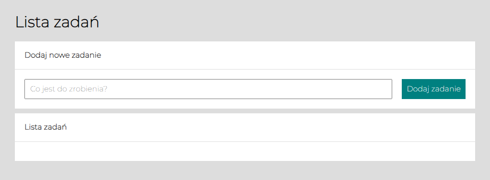
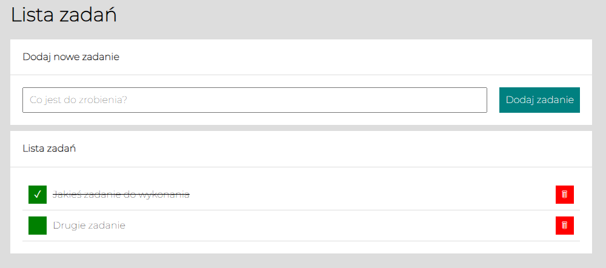

# Artur Regucki - ToDoList



"To do list" is a miniaplication, with functionality like adding new tasks, marking tasks as done or deleting tasks.

https://artur1525.github.io/TO-DO-LIST/

Kliknij link powyżej ;)
```
### I used:

- HTML
- Java Script
- CSS
- BEM
- GRID